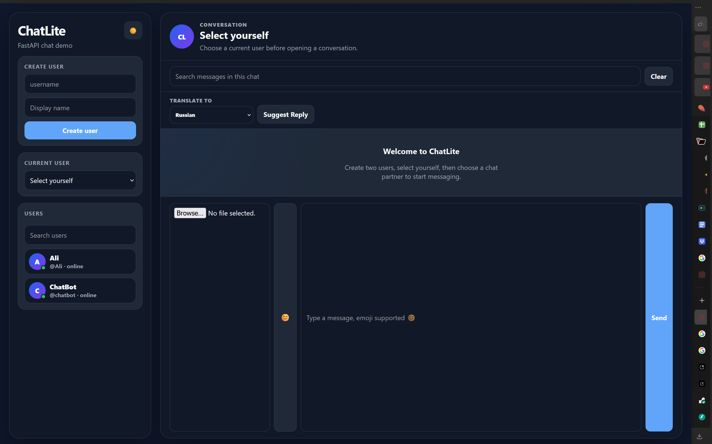
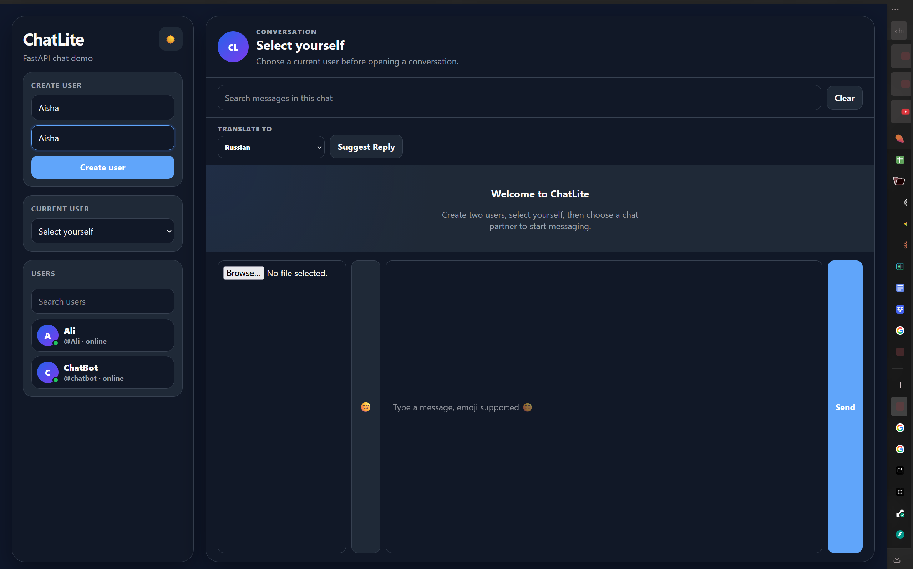
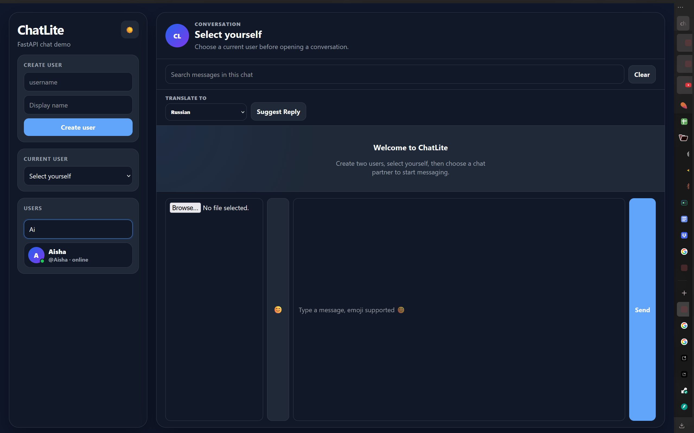
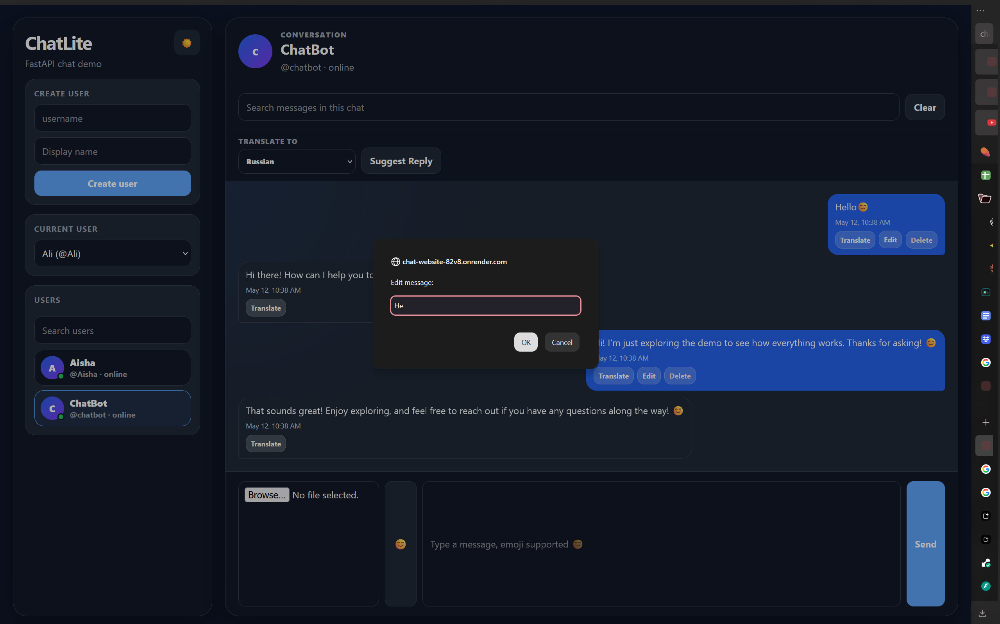
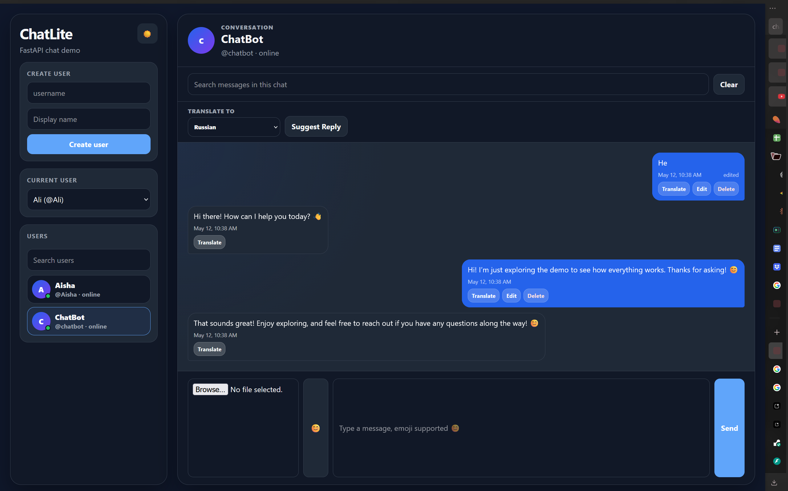
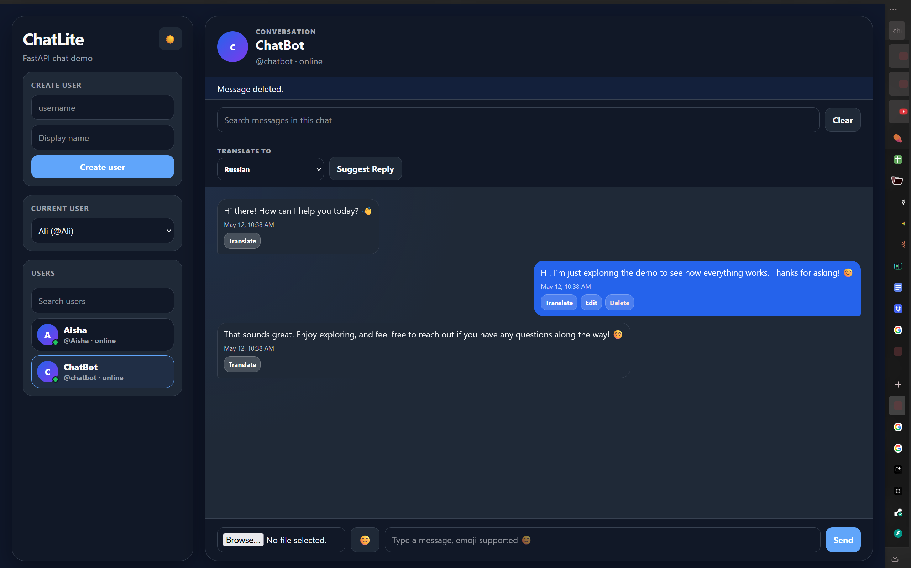
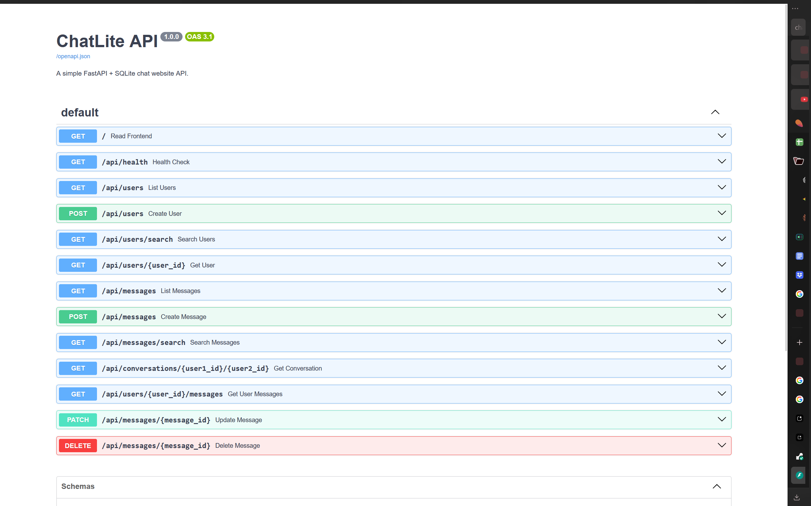

# ChatLite — FastAPI Chat Website

ChatLite is a simple chat website built with FastAPI, SQLite, SQLAlchemy, and vanilla HTML/CSS/JavaScript. It is designed as a clean final-project MVP that runs locally and can be deployed to Render as a free web service.

## Features

- Register users with a username and display name
- List and search users
- Select a current user and chat partner
- Send and receive messages with HTTP polling every 2 seconds
- View full conversation history
- Search messages
- Show messages by conversation and by user through API endpoints
- Edit and soft-delete messages
- Fake online status indicators
- Profile initials/avatar circles
- Timestamps and edited labels
- Clean chat bubbles
- Dark mode with localStorage preference
- Google Cloud Translation API support through a backend endpoint
- Optional Gemini-powered AI replies when `GEMINI_API_KEY` exists
- Rule-based AI reply suggestions when Gemini is not configured
- Built-in ChatBot demo user with automatic replies
- Image upload messages with optional captions
- Polling-based typing indicator
- Responsive/mobile-friendly layout
- FastAPI `/docs` support for testing all API routes

## Tech Stack

- Python
- FastAPI
- SQLite
- SQLAlchemy
- Pydantic
- Uvicorn
- httpx
- Vanilla HTML, CSS, and JavaScript

## Local Setup

1. Clone or download this project.
2. Open a terminal in the `chat-website` folder.
3. Create and activate a virtual environment:

```bash
python -m venv .venv
```

Windows PowerShell:

```powershell
.\.venv\Scripts\Activate.ps1
```

macOS/Linux:

```bash
source .venv/bin/activate
```

4. Install dependencies:

```bash
pip install -r requirements.txt
```

## How To Run

Start the development server:

```bash
uvicorn main:app --reload
```

Open the app:

```text
http://127.0.0.1:8000
```

Open the API docs:

```text
http://127.0.0.1:8000/docs
```

SQLite creates `chat.db` automatically when the app starts.

## Environment Variables

Do not commit API keys. Keep them in your local shell, `.env` manager, or Render dashboard environment variables.

- `GOOGLE_TRANSLATE_API_KEY`: required only for the translation feature.
- `GEMINI_API_KEY`: optional. If missing, ChatLite uses safe rule-based AI suggestions and ChatBot replies.
- `GEMINI_MODEL`: optional. Defaults to `gemini-flash-latest`.

Local PowerShell example:

```powershell
$env:GOOGLE_TRANSLATE_API_KEY="your-google-key"
$env:GEMINI_API_KEY="your-gemini-key"
uvicorn main:app --reload
```

## API Overview

- `GET /api/health`
- `POST /api/users`
- `GET /api/users`
- `GET /api/users/search?q=`
- `GET /api/users/{user_id}`
- `POST /api/messages`
- `GET /api/messages`
- `GET /api/messages/search?q=`
- `GET /api/conversations/{user1_id}/{user2_id}`
- `GET /api/users/{user_id}/messages`
- `PATCH /api/messages/{message_id}`
- `DELETE /api/messages/{message_id}`
- `GET /api/translate?text=&target=&source=auto`
- `POST /api/ai/suggest`
- `GET /api/ai/status`
- `POST /api/upload-image`
- `POST /api/typing`
- `GET /api/typing/{user1_id}/{user2_id}?viewer_id=`

## Additional Demo Features

### Translation With Google Cloud Translation API

The frontend calls `GET /api/translate` when a user clicks Translate on a message. The backend reads `GOOGLE_TRANSLATE_API_KEY` and calls Google Cloud Translation Basic/v2. The API key is never placed in frontend JavaScript.

### Optional Gemini Support

If `GEMINI_API_KEY` exists, the backend may use Gemini for reply suggestions and ChatBot answers. If it is missing or the API call fails, the app falls back to simple hardcoded demo responses.

### Image Upload Demo Storage

Images are uploaded through `POST /api/upload-image` and stored in the local `uploads/` folder. This is demo local storage. For production, use cloud object storage such as Google Cloud Storage, S3, or another managed file service.

### Typing Indicator

Typing status uses backend in-memory state plus HTTP polling. It does not use WebSockets. Typing indicators expire automatically after 3 seconds.

## Render Deployment

This project includes `render.yaml`, `runtime.txt`, and `requirements.txt` for Render.

Render settings:

- Build command: `pip install -r requirements.txt`
- Start command: `uvicorn main:app --host 0.0.0.0 --port $PORT`
- Runtime: Python 3.11.9
- Service type: Web Service
- Plan: Free

Steps:

1. Upload this project to a public GitHub repository.
2. Create a new Render Web Service from that repository.
3. Use the included `render.yaml` or manually set the build/start commands above.
4. In Render dashboard, add `GOOGLE_TRANSLATE_API_KEY` as an environment variable if you want translation.
5. Optionally add `GEMINI_API_KEY` for Gemini suggestions and ChatBot replies.
6. Deploy and open the Render URL.

Note: This demo uses SQLite for simplicity. Render free deployment may reset SQLite data after restart or redeploy, which is acceptable for demo purposes. For production, PostgreSQL is recommended.

## Live Website

Live website link: `https://chat-website-82v8.onrender.com/`

## Demo Video

YouTube demo video link: `https://youtu.be/sNf4_Uw9v5U`

## Screenshots

### Home Screen


### Chat Screens



### Edit Message



### Delete Message



### FastAPI Docs

